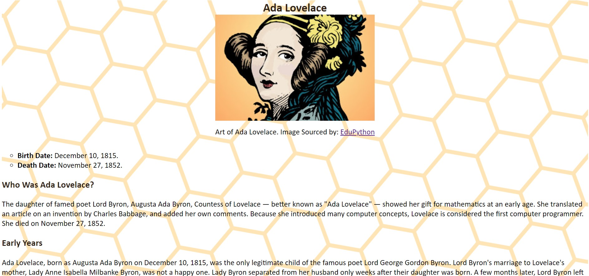

# tribute-page
English | <a href="https://github.com/samlatavares/tribute-page/blob/master/translations/pt-br/README.md">Português</a>

</img>

## What is this project?
Ada Lovelace's Tribute Page made for the FreeCodeCamp's Responsive Web Design Certification.

## Working with this project
The file index.html contains all page's code. You just need to open it using a text editor.

To clone the project:
- git clone https://github.com/samlatavares/tribute-page

If you want to see this project's result you can access <a href="https://samlatavares.github.io/tribute-page/" target="_blank">here</a>.
